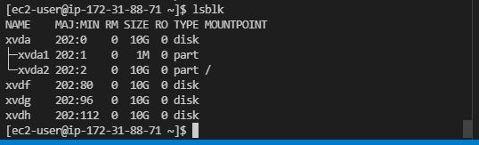

# Documentation for Project 6 - WordPress Solution
- Step 1 -- Setup Servers on AWS 
  
   - `sudo apt-get update && sudo apt-get upgrade` 

   -  
  
### Create volumes, mount volumes, partion volumes
    ```
        sudo gdisk /dev/xvdf
        sudo yum install lvm2
        sudo lvmdiskscan
        sudo pvcreate /dev/xvdf1
        sudo pvcreate /dev/xvdg1
        sudo pvcreate /dev/xvdh1
        sudo vgcreate webdata-vg /dev/xvdh1 /dev/xvdg1 /dev/xvdf1
        sudo lvcreate -n apps-lv -L 14G webdata-vg
        sudo lvcreate -n logs-lv -L 14G webdata-vg
        sudo vgdisplay -v #view complete setup - VG, PV, and LV
        sudo lsblk 
        sudo mkfs -t ext4 /dev/webdata-vg/apps-lv
        sudo mkfs -t ext4 /dev/webdata-vg/logs-lv
    ```

  - 
  - 
  - 
  - 
  - 

### Create Logical mount parts

    ```
    sudo mkdir -p /var/www/html
    sudo mkdir -p /home/recovery/logs
    sudo mount /dev/webdata-vg/logs-lv /var/log
    sudo rsync -av /home/recovery/logs/. /var/log
    sudo nano /etc/fstab 
    ```
  - 
  - 
  - 
  - 
  - 
  
    ```
    sudo mount -a
    sudo systemctl daemon-reload
    ```

### Install WordPress on your Web Server EC2
    ```
    sudo systemctl enable httpd
    sudo systemctl start httpd
    ```
   - 
   - 
### Install PHP and it’s depemdencies
    ```
    sudo yum install https://dl.fedoraproject.org/pub/epel/epel-release-latest-8.noarch.rpm
    sudo yum install yum-utils http://rpms.remirepo.net/enterprise/remi-release-8.rpm
    sudo yum module list php
    sudo yum module reset php
    sudo yum module enable php:remi-7.4
    sudo yum install php php-opcache php-gd php-curl php-mysqlnd
    sudo systemctl start php-fpm
    sudo systemctl enable php-fpm
    setsebool -P httpd_execmem 1
    ```
   - 

### Download wordpress and copy wordpress to var/www/html
	```
	mkdir wordpress
	cd   wordpress
	sudo wget http://wordpress.org/latest.tar.gz
	sudo tar xzvf latest.tar.gz
	sudo rm -rf latest.tar.gz
	cp wordpress/wp-config-sample.php wordpress/wp-config.php
	cp -R wordpress /var/www/html/
	```
### Configure DB to work with WordPress
	```
	sudo mysql
	CREATE DATABASE wordpress;
	CREATE USER `myuser`@`<Web-Server-Private-IP-Address>` IDENTIFIED BY 'mypass';
	GRANT ALL ON wordpress.* TO 'myuser'@'<Web-Server-Private-IP-Address>';
	FLUSH PRIVILEGES;
	SHOW DATABASES;
	exit
	```
### Connect to Mysql Server from WebServer
	```
	sudo yum install mysql
	sudo mysql -u admin -p -h <DB-Server-Private-IP-address>
	```
   -  
   - 
   - 
    
